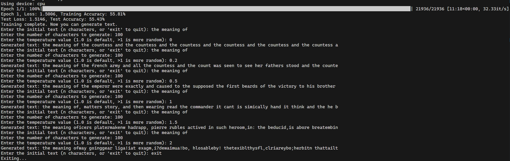

[](https://classroom.github.com/a/xUFhSpv5)
# Assignment 7: Neural Complete

## Overview

In Assignment 6 you computed a language model from scratch. Now it's time to apply your deep learning knowledge to the autocomplete problem and use what you've learned about deep learning to train a neural language model for next character prediction.

## Assignment Objectives

1. Understand how a character-level RNN works and how it can model sequences.
2. Implement a recurrent neural network in PyTorch.
3. Learn about sequence modeling, hidden state propagation, and embedding layers.
4. Train a model to predict the next character in a sequence using a sliding window dataset.
5. Generate novel sequences of text based on a trained model.
6. Experiment with model hyperparameters and observe their effect on performance.

## Pre-Requisites

- **Python & PyTorch:** You should be familiar with Python syntax and have basic experience with PyTorch tensors and modules (from Assignment 5).
- **Neural Networks:** You should understand how neural networks work, including layers, forward passes, and training with loss functions.
- **Recurrent Neural Networks:** You should have seen the basic RNN recurrence equations in lecture.

---

## Student Tasks

### Milestone 0. Understand the code

Start by opening `rnn_complete.py` reading through whats provided and familiarizing yourself with the structure.

The key components are
- A `CharDataset` class to slice training data into overlapping character sequences.
- A `CharRNN` class with an incomplete `forward()` method and missing parameters.
- A training loop that handles batching and the forward pass.
- A sampling loop to generate new text using your trained model 2 functions are incomplete.

In the `CharDataset` class you will notice a concept of `stride` is used. When creating the training data for a character-level language model, we break long text into shorter overlapping sequences so the model can learn from many parts of the text.

This is most easily understood with an example. Lets say your training data is the sequence "abcedfgh" and you are learning a model for `sequence_length=3`. 

#### With `stride = 1`:

| Input  | Target |
|--------|--------|
| "abc"  | "bcd"  |
| "bcd"  | "cde"  |
| "cde"  | "def"  |
| "def"  | "efg"  |
| "efg"  | "fgh"  |

#### With `stride = 2`:

| Input  | Target |
|--------|--------|
| "abc"  | "bcd"  |
| "cde"  | "def"  |
| "efg"  | "fgh"  |

So as you can see, a higher stride results in less examples. This is a training hyperparameter which you can experiment with — smaller values increase data size and overlap, while larger values reduce redundancy and speed up training.

### Milestone 1. Teach an RNN the alphabet

Now that you've gone through the code it's time to implement the RNN and get the model to train on the alphabet sequence. Note once you've completed this your model should get a very high accuracy (close to 100%) as this is a very simple repeated sequence.

First, we'd recommend you complete the training section up until the training loop. Then, complete the model implementation. Then complete the training loop and try to train your model.

#### Training setup components

The code has a number of TODOs prior to the training loop, these should be pretty straightforward and are designed to help you understand the flow of the code by tieing in concepts from previous assignments.

#### RNN implementation

Inside `CharRNN.__init__()`, you’ll need to define the learned parameters of the RNN

**Your task**: Randomly initialize each parameter using `nn.Parameter(...)`, and follow the structure discussed in lecture. Keep standard deviations small (e.g., * 0.01).

Inside the `forward()` method:

```python
for t in range(l):
    #  TODO: Implement forward pass for a single RNN timestamp
    pass
```

Here you’ll implement the recurrence equation for the RNN. Each timestep receives:
- the current input embedding x_t
- the previous hidden state h_{t-1}

and outputs:
- the new hidden state h_t

**Your task**:
- Implement the RNN recurrence step
- Append the computed hidden to the `output` list
- Update `h_t_minus_1` to be the computed hidden for subsequent timesteps
- After the loop, compute:
  - `final_hidden` = create a `clone()` (deep copy) of your final hidden state to return
  - `logits` = result of projecting the full hidden sequence to the output space

---

#### Finish the training loop, test loop, and set the hyperparameters
Now that you've finished the model you have the forward pass established, finish the backward pass of the model using the PyTorch formula from Assignment 5 and create a test loop following a similar structure (don't forget to stop computing gradients in the test loop!).

Once that's done the code should start training when you run the file. However, it will not train successfully. In order to train the model properly you will need to update the training hyperparameters. If everything is set up properly at this point you should see a model that learns to predict the alphabet with very high accuracy 98+% and very low loss (near 0).

#### Hyperparmeter Tuning Tips

1. **Start with reasonable model parameters**

The first thing you should do is set reasonable starting hyperparams for the model itself. This will come to understanding what each hyperparams does by understanding the architecture and the objective you're training your model to complete. Set these and keep them fixed while you tune the training hyperparameters. As long as these are close enough the model will learn. They can be further refined once you have your training is starting to learn something.

2. **Refine learning rate**

When it comes to learning hyperparameters, the most important is learning rate. Others often are just optimizations to learn faster or maximize the output of your hardware. It's useful to imagine your loss space as a large flat desert. The loss space for neural networks is often very 'flat' with small 'divots' that are optimal regions. You want a learning rate that is small enough to be able to find these divots without jumping over them. Further you also want them to be small enough to reach the bottom of the divot (although optimizers these days often change your learning rate dynamically to accomplish this). I'd recommend starting with as small a learning rate as possible, if it's too small you're not traversing the space fast enough (never finding a divot, or only moving slightly into it). If this is the case, make it progressively larger, say by a factor of 10. Eventually you'll find a "sweet spot" and your model will learn.

3. **Refine other parameters**

Now that your model is learning something you can try to optimize it further. At this point try refining the model and other learning parameters. I wouldn't recommend changing the learning rate by much maybe only a factor of 5 or less.

### Milestone 2. Generating Text

Now that we've learned a model, let's use it to generate text. In this part of the assignment, your task is to implement the `generate_text` function, which uses a trained RNN model to generate text character-by-character, continuing from a given input. The function will produce an extended sequence by repeatedly predicting and appending the next character to the input.

#### `generate_text(model, start_text, n, k, temperature=1.0)`
- Take an initial input text of length n from the user, convert it into indices using a - predefined vocabulary (char_to_idx).
- Use a trained model to predict the next character in the sequence.
- Append the predicted character to the input, extend the input sequence, and repeat the process until k additional characters are generated.
- Return the generated text, including the original input and the newly predicted characters.

**Your task**: Generate text and test that you can generate an alphabet sequence from your trained model.

```
Enter the initial text: cde
Enter the number of characters to generate: 5
Generated text: fghijk
```

### Milestone 3. Predicting English Words

Now that you have trained the model on a simple sequence it's time to see how well it performs on an English corpus: `warandpeace.txt`. To do this, uncomment the read_file line at the beginning of the training section and re-run your code.

Now that we're using real data you will notice a few things, first the training will take much longer per epoch as the dataset is much larger. Second, training may not proceed as smoothly as it did before. This is because the relationships between characters in english is much more complex than in the simple sequence, so we will need to revisit our hyperparameters. 

**Your task**: Get your RNN working on the real data by adjusting your training hyperparameters.

#### Tips
In addition to the tips provided in Milestone 1, here's some specific tips.

1. If you use the full `warandpeace.txt` dataset you can get a well-trained model in **1 epoch**. And with a reasonable selection of hyperparameters, this epoch will take 5-10 minutes.

2.  If you don't see a significant jump after the first epoch, you shouldn't wait, change the parameters and try again. 

3. If you're losing patience, try taking a fraction of the dataset so you don't have to wait as long, and then run it on the full set after that's working. 

4. Don't expect a perfect model. What would it mean to have 90% accuracy on this model, is that realistic? You'd have created a novel writing masterpiece of a model! Realistically your performance will be much lower, around 50-60% with a loss around 1.5. But even with this "low performance" you should see words (or pseudo-words) in your output but not meaningful sentences.

### Milestone 4. Final Report

In your report, describe your experiments and observations when training the model with two datasets: (1) the sequence "abcdefghijklmnopqrstuvwxyz" * 100 and (2) the text from warandpeace.txt.

Include the final train and test loss values for both datasets and discuss how the generated text differed between the two. Explain the impact of changing the temperature parameter on the text generation, and provide examples. Reflect on the challenges you faced, your thought process during implementation, and the key insights you gained about RNNs and sequence modeling.

This section should be about 1-2 paragraphs in length and can include a table or figure if it helps your explanation. You can put this report at the end of this readme or in a separate markdown file.


## What to Submit

1. Your completed `rnn_complete.py` file with all TODOs filled in.
2. A PDF of your Final Report.

How to generate a pdf of your Final Report Section:
    
- On your Github repository after finishing the assignment, click on README.md to open the markdown preview.
- Use your browser 's "Print to PDF" feature to save your PDF.

Please submit to Assignment 7 Neural Complete on Gradecsope.

## TODO: Complete 383GPT Exit Survey
Link : https://forms.gle/YWBbJc3wDMu3U1CYA

Please also complete this 383GPT Exit Survey about your experience using 383GPT in this course. 

This survey is an important opportunity for us to gather feedback about how the tool supported your learning and how we can improve it for future classes.

Completion of the survey is worth 10 points as a part of Assignment 7 so please take the time to provide thoughtful and honest responses. It should take approximately 10 minutes to complete.

Your answers to this survey will in no way impact your grade in this course, please answer honestly.

## TODO: Fill out your Final Report here

How many late days are you using for this assignment? - 4

1. Describe your experiments and observations

The intial hyperparameters were far outside the reasonable range as expected to I changed them to be more resonable first. This is what I ended up with:

```
sequence_length = 25
stride = 1 
embedding_dim = 32
hidden_size = 64
learning_rate = 0.002
num_epochs = 1
batch_size = 64
```

The sequence length is a more reasonable 25 compared to the original 1000. I chose a stride of 1 to maximize data size and overlap. I increased embedding dim and hidden size to 32 and 64 respectively for the model to be able to retain a more reasonable amount of information. I put the learning rate at a more reasonable 0.002 so that the model takes smaller steps ad so we don't miss the lowest loss during gradient descent. I made batch size 64 to get a good average for the one epoch since war and peace is quite a large dataset. 

Initial: 
- Training:
  - Loss: 1.8320
  - Accuracy: 46.51%
- Test:
  - Loss: 1.8302
  - Accuracy: 46.60%

This gave me a decent baseline result but I wanted to work towards a <1.6 loss and a >50% accuracy. I made the following changes in the next iteration:

```
sequence_length = 30
stride = 1 
embedding_dim = 64
hidden_size = 128
learning_rate = 0.001
num_epochs = 1
batch_size = 128
```

Increasing the sequence length to 30 might help the model see more data per sequence. I also increased the embedding dim and hidden size to 64 and 128 respectively to again increase the amount of context the model has to predict with. I reduced the learning rate to 0.001 to allow gradient descent more precise. Finally, increasing batch size to 128 simply allows the model to evaluate more data over the same 1 epoch.

Change 1: 
- Training:
  - Loss: 1.6773
  - Accuracy: 50.99%
- Test:
  - Loss: 1.6556
  - Accuracy: 51.33%

These new numbers show a significant positive change. I have reached my goal of <50% accuracy but I am just over the <1.6 loss I wanted. I made the following changes to achieve that:

```
sequence_length = 40
stride = 1 
embedding_dim = 64
hidden_size = 256
learning_rate = 0.001
num_epochs = 1
batch_size = 128
```

I again increased the sequence length to 40 this time to continue letting the model see more data per sequence. Increasing the hidden size to 256 will probably make the most change since it would give the model more memory and parameters and therefore context to work with, so I made the change.

Change 2: 
- Training:
  - Loss: 1.5006
  - Accuracy: 55.81%
- Test:
  - Loss: 1.5146
  - Accuracy: 55.43%

This final change seems to have given me the results I wanted.

2. Analysis on final train and test loss for both datasets

The alphabet dataset was close to perfect from the initial hyperparameters (before the two changes), with very high accuracies (95+) and a very low loss (<0.3). Improving the hyperparameters maintained this performance.

The final result for war and peace, however, was much better than the initial try. The loss reduced from around 1.8 to around 1.5, a good decrease. Similary the accuracy went from around 46% to 55%, an almost 10% increase. This result would probably be much better over more epochs. 

3. Explain impact of changing temperature

For this experiment I used the intial sequence "the meaning of" with a number of characters of 100. Changing the temperature would affect the randomness of results so let's see what happens:

| Temperature | Generated Text (starting with "the meaning of")                                  |
|-------------|--------------------------------------------------------------------------------------|
| 0 | the meaning of the countess and the countess and the countess and the countess and the countess and the countess a |
| 0.2         | the meaning of the french army and all the countess and the count was seen to see her fathers stood and the counte |
| 0.5         | the meaning of the emperor were exactly and caused to the supposed the first beards of the victory to his brother |
| 1.0         | the meaning of, matters story, and then wearing read the commander it cant is simically hand it think and the he b |
| 1.5         | the meaning oficers platermakenw hadrapp, pierre rubles actived in such heroom,in: the beducid,is abore breatembin |
| 2.0         | the meaning ofway goinggear liga!iat exagm,i?dewaimua!bo, hlosableby! thetexiblthysfl,clriareybo;herbitn thattailt |

The first result, when the randomness is supposed to be 0, gives a repeated sequence of complete words after the intial text. This probably means it is matching a sequence directly from the text repeatedly. For temperatures 0.2 and 0.5, it continues to generate complete words and seem to be slightly coherent. At temperature 1 it seems to make up words like "simically". At temperature 1.5 there is no space or punctuation after the "of" in "the meaning of" and the words are incomprehensible thought it seems to maintain the structure of a sentence visually. At temperature 2, the words don't make any sense and neither does the sentence structure. It has long sequences of seemingly random characters for words.

4. Reflection

This was a tough project for me since I had not had experience with coding RNNs before this. Implementing the forward pass involved lots of analysing the slides and making steady progress until it seemes to work. Implementing the training and testing loop had me going back to homework 5 to remember how I had done it. Tuning hyperparameters was both diffivult and tedious. Seeing whether the changes you made had a good result felt like a lottery and it was especially difficult since you had to wait for a while for each result. I wish I had looked into doing the operations on my gpu instead since that would have probably saved me some time. Over this project I have seen evidence for the basic assumptions that giving the models more data and context allow them to make better predictions, even over just 1 epoch.

5. IMPORTANT: Include screenshot of output for generate_text() function: 


